# 1 实验目的

- 将实验2的需求落实为可开发的模块、数据、接口和界面。
- 完成关键架构决策与风险替代方案。
- 形成实验4可直接使用的设计基线。

# 2 需求输入与设计范围

## 2.1 核心流程

**上传CSV与赛题背景 → 本地体检 → 语义推荐 → 本地校验 → 人工确认 → 导出Pandas代码。**

用户故事：作为数模参赛者，我希望快速得到少量、可解释且可运行的衍生特征，以便缩短特征工程时间。

| 编号 | 核心需求 | 设计落实 | 验收条件 |
|---|---|---|---|
| FR-01 | 上传CSV并设置背景、Target | 上传页、`app.py` | 合法CSV进入体检；错误文件给出原因 |
| FR-02 | 本地画像与风险扫描 | `profiler.py`、字段画像 | 输出缺失率、偏度、相关性与风险级别 |
| FR-03 | 推荐可解释特征 | `recommender.py`、推荐卡片 | 返回3-10条 `{name, op, params, reason}` |
| FR-04 | 安全执行与代码生成 | `codegen.py`、算子注册表 | 未注册算子或未知列被拒绝，不使用`exec/eval` |
| FR-05 | 高风险人工确认 | 风险确认页、确认记录 | 红/黄项默认锁定，确认后才可导出 |
| NFR-01 | 隐私 | 原始数据仅本地处理 | 发往模型的内容不含原始行数据 |
| NFR-02 | 性能 | 超大数据先抽样2万行 | 常规数据体检目标≤3秒 |
| NFR-03 | 可靠性 | 本地规则降级 | 模型超时时仍可完成基础推荐 |

## 2.2 普通程序与AI边界

| 责任方 | 主要职责 | 检查方式 |
|---|---|---|
| 用户 | 提供背景、选择Target、确认风险 | 页面确认与最终选择 |
| 普通程序 | 统计、风险扫描、算子执行、代码模板 | 类型/列名/数值边界校验 |
| LLM | 理解字段语义，给出机理解释与受控算子意向 | JSON Schema + 本地白名单 |
| 工具库 | Pandas/NumPy计算与可视化 | 单元测试、预览结果 |

# 3 技术选型与架构决策

## 3.1 候选方案

| 方案 | 熟悉度 | 成本 | AI接入 | 测试/部署 | 结论 |
|---|---:|---:|---:|---:|---|
| Python + Streamlit | 高 | 低 | 易 | 单机启动简单 | 采用 |
| Python + FastAPI + Vue | 中 | 中 | 易 | 前后端工作量较大 | 暂不采用 |
| Java + Spring Boot | 中 | 高 | 中 | 对数据分析生态不友好 | 不采用 |

## 3.2 简要ADR

| 决策 | 选择 | 理由 | 不足/替代 |
|---|---|---|---|
| ADR-01 界面框架 | Streamlit单体应用 | 一人可快速完成，适合数据看板 | 复杂交互受限；后续可换FastAPI+Vue |
| ADR-02 数据保存 | 会话内存 + 本地导出文件 | 不保存原始CSV，隐私和实现成本更优 | 刷新后状态丢失；后续可加SQLite |
| ADR-03 AI输出 | JSON Schema + 受控算子 | 可校验、可审计、避免任意代码 | 算子范围有限；按需扩展注册表 |
| ADR-04 架构风格 | 轻量分层/模块化 | UI、业务、外部依赖边界清晰 | 单机扩展性一般，但满足MVP |

关键依赖替代：云端模型不可用时，`recommender.py`切换本地规则引擎；Streamlit受限时保留业务模块，仅替换界面层。

# 4 软件架构与模块设计

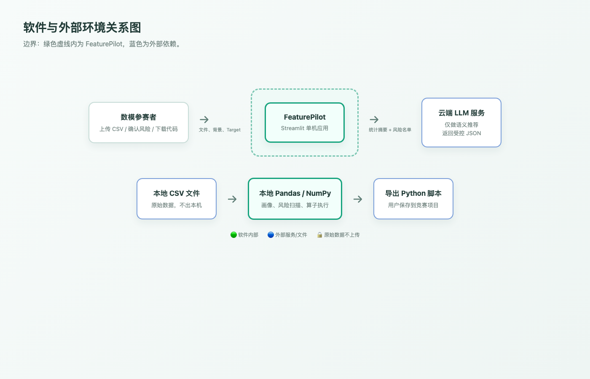{width=96%}

图1说明：原始CSV只进入本地程序；云端模型只接收统计摘要、背景和风险名单。

\newpage

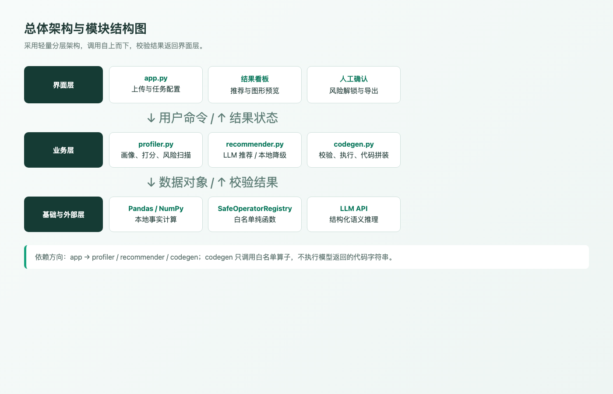{width=96%}

图2说明：界面层调用业务层；`codegen.py`只通过白名单算子执行推荐。

| 模块 | 职责 | 直接依赖 |
|---|---|---|
| `app.py` | 会话、上传、导航、结果反馈 | 三个core模块 |
| `profiler.py` | 数据画像、打分、风险扫描 | Pandas、scikit-learn |
| `recommender.py` | LLM推荐、本地降级 | 模型API、Profile |
| `codegen.py` | 参数校验、预览执行、脚本拼装 | NumPy、算子注册表 |

# 5 数据、接口与核心流程设计

## 5.1 数据模型

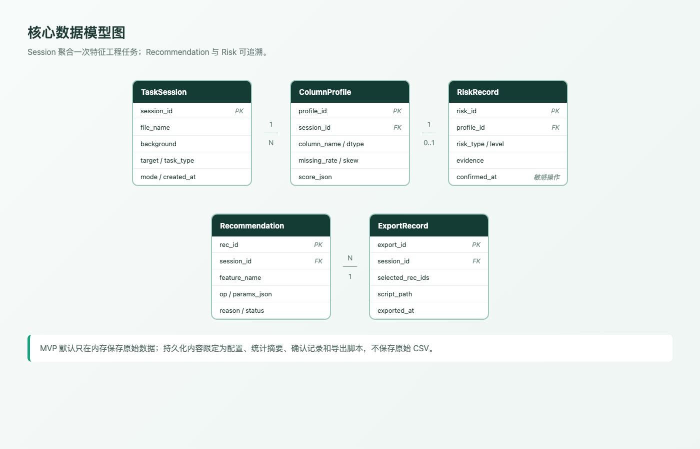{width=96%}

图3说明：MVP不持久化原始CSV；`confirmed_at`用于追踪高风险特征的人工确认。

## 5.2 主要接口

| 接口 | 提供/调用 | 输入 | 输出 | 失败 |
|---|---|---|---|---|
| `profile(df,target,task)` | profiler / app | DataFrame、目标列、任务类型 | Profile | 空表、列不存在、类型错误 |
| `recommend(profile,context)` | recommender / app | 摘要、背景、风险名单 | Recommendation[] | 超时后切本地规则 |
| `validate_and_apply(df,rec)` | codegen / app | 数据副本、推荐JSON | 新特征、校验记录 | 未知算子/列直接拒绝 |
| `export_code(recs)` | codegen / app | 已选择且已解锁推荐 | `.py`文本 | 空选择提示用户 |

正常调用：

```json
{"feature_name":"pressure_volume_work","op":"interaction","params":["pressure","volume"],"reason":"近似表示有效做功"}
```

错误调用：

```json
{"feature_name":"x","op":"python_eval","params":["missing_col"]}
```

处理结果：`op`未注册且列名不存在，整条建议拒绝并写入校验日志。

## 5.3 核心流程

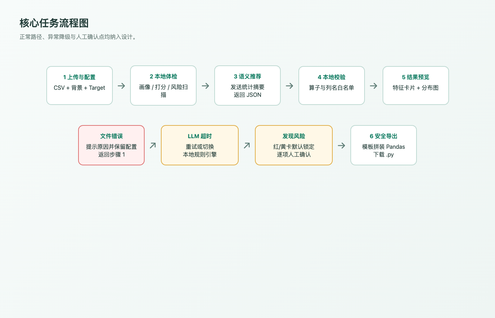{width=96%}

图4说明：文件错误回到上传页；模型超时可降级；风险项必须人工确认。

# 6 界面原型与交互设计

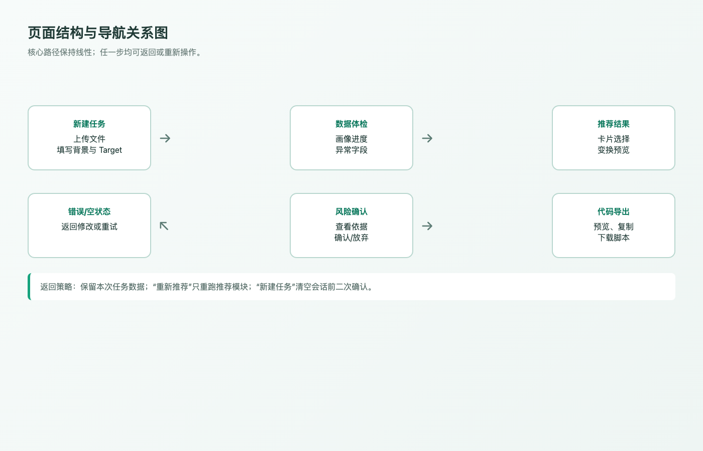{width=96%}

图5说明：主路径线性推进，允许返回、重试和重新推荐。

\newpage

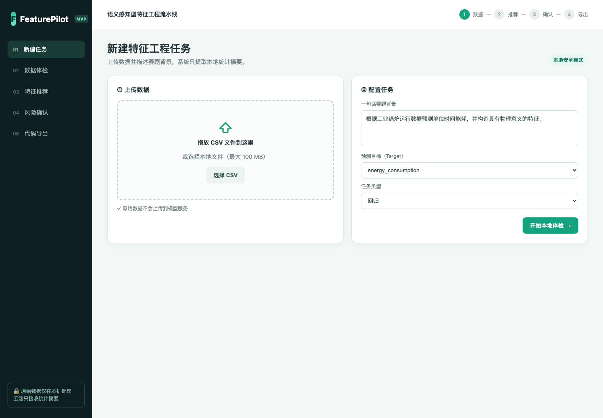{width=96%}

图6操作记录：选择CSV，填写赛题背景、Target和任务类型。页面明确提示原始数据不上传。

\newpage

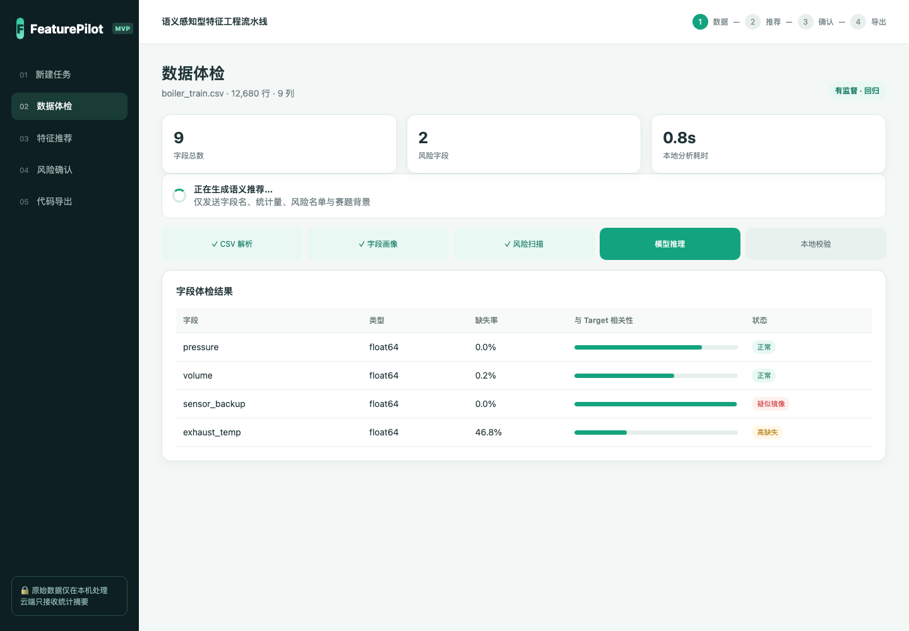{width=96%}

图7操作记录：显示字段数、风险数、分析耗时和字段级风险，加载时给出当前阶段。

\newpage

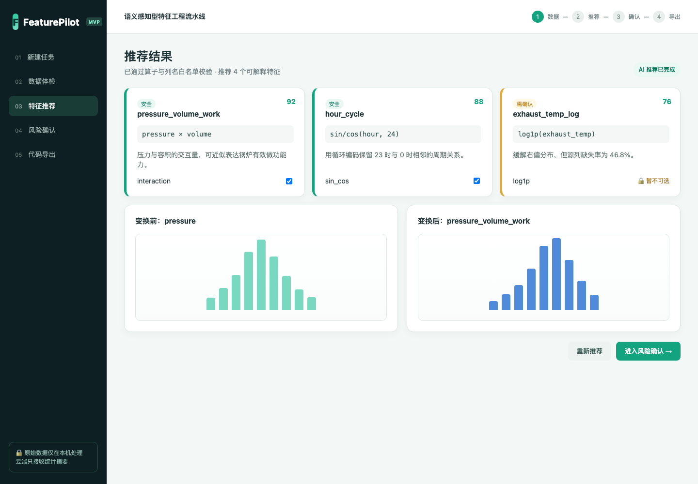{width=96%}

图8操作记录：安全项可直接选择；临界项锁定；变换前后分布并排显示。

\newpage

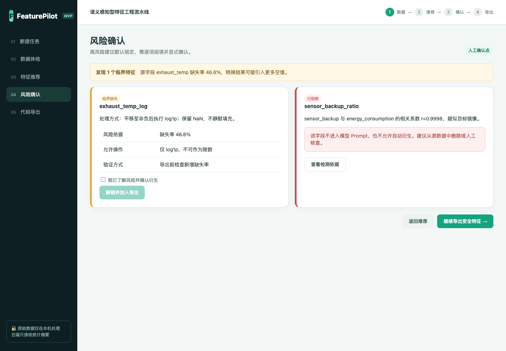{width=96%}

图9操作记录：黄卡可逐项确认，镜像/泄露红卡默认阻断，避免误导出。

\newpage

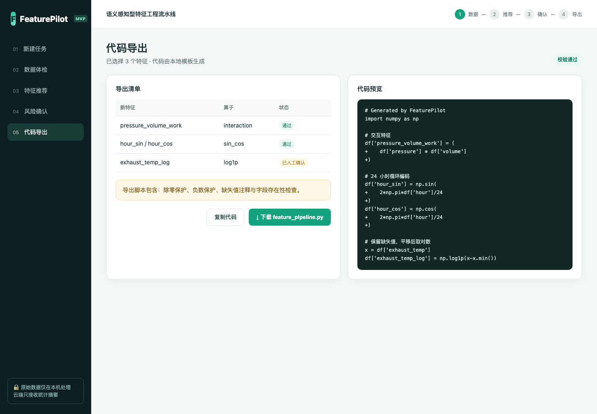{width=96%}

图10操作记录：左侧核对清单与状态，右侧预览模板生成的Pandas代码。

\newpage

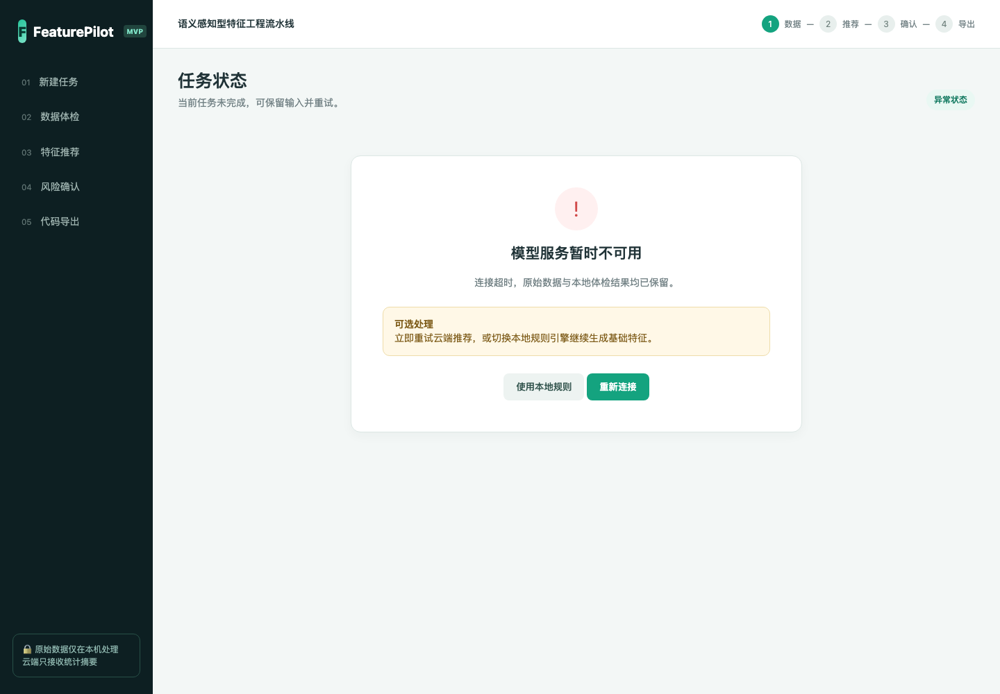{width=96%}

图11操作记录：保留本地体检结果，可重连模型或切换本地规则，不让流程中断。

## 6.1 元素与反馈

| 类型 | 设计 |
|---|---|
| 静态元素 | 阶段进度、隐私提示、风险规则、公式说明 |
| 输入元素 | CSV、背景文本、Target、任务类型、复选框 |
| 命令元素 | 开始体检、重新推荐、确认解锁、复制/下载 |
| 动态元素 | 进度、指标、推荐卡片、分布图、代码预览 |
| 状态反馈 | 加载、空数据、格式错误、模型超时、风险阻断、导出成功 |

# 7 设计一致性检查与版本保存

| 需求 | 架构模块 | 数据/接口 | 界面 | 检查结果 |
|---|---|---|---|---|
| FR-01 | app、profiler | TaskSession、profile | 图6、图7 | 已落实 |
| FR-02 | profiler | ColumnProfile、RiskRecord | 图7 | 已落实 |
| FR-03 | recommender | Recommendation、recommend | 图8 | 已落实 |
| FR-04 | codegen | validate/apply/export | 图10 | 已落实 |
| FR-05 | app、codegen | RiskRecord.confirmed_at | 图9 | 已落实 |
| NFR-01~03 | 全模块 | 摘要传输、抽样、降级 | 图7、图11 | 已落实 |

检查发现并调整：

1. 初稿只有推荐成功页，补充加载、模型超时与本地降级状态。
2. 初稿风险特征可直接勾选，改为默认锁定并逐项确认。
3. 初稿允许模型返回公式字符串，改为`op + params`受控结构。

版本证据：设计图、原型与截图保存在 `prototype/`、`assets/experiment3/`；本地Git提交为 **`6dfe01d`（完成实验三架构图与界面原型）**。

# 8 实验小结

本实验完成了需求追踪、技术选型、分层架构、数据与接口、异常流程及6种界面状态。最终设计坚持“本地算事实、模型做语义、程序强校验、风险交给人确认”，可直接作为实验4的开发基线。
